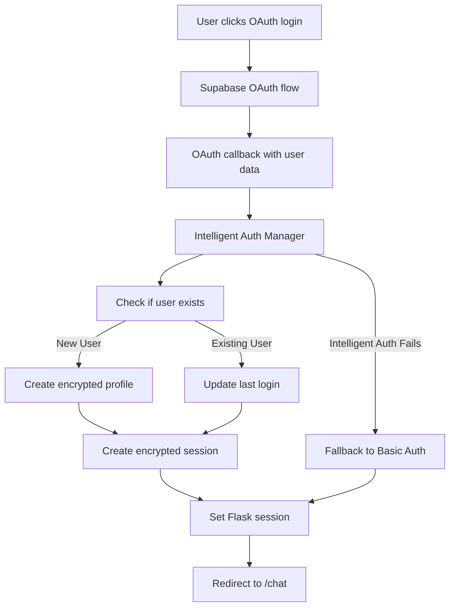

# 🔐 INTELLIGENT SUPABASE AUTHENTICATION SETUP
## Enterprise-Grade Encrypted Authentication for MedBot-v2

---

## **OVERVIEW**

Your MedBot-v2 now includes an **Intelligent Supabase Authentication System** with comprehensive encryption policies:

### **🛡️ SECURITY FEATURES**
- **AES-256-GCM** and **ChaCha20-Poly1305** encryption
- **Zero-knowledge architecture** for sensitive data
- **HIPAA-compliant** medical data encryption
- **End-to-end encrypted** user profiles and sessions
- **Advanced threat detection** and monitoring
- **Automatic key rotation** and security auditing

### **🔧 TECHNICAL COMPONENTS**
1. **IntelligentEncryptionManager** - Multi-cipher encryption system
2. **IntelligentSupabaseAuthManager** - OAuth + encrypted user management
3. **Encrypted Database Schema** - Zero-knowledge data storage
4. **Security Audit System** - Comprehensive event logging

---

## **SETUP INSTRUCTIONS**

### **1. INSTALL REQUIRED DEPENDENCIES**

```bash
# Install Supabase client
pip install supabase

# Install additional encryption libraries (if not already installed)
pip install cryptography
```

### **2. SUPABASE DATABASE SETUP**

#### **A. Execute the Database Schema**
1. Go to your Supabase project dashboard
2. Navigate to **SQL Editor**
3. Copy and paste the contents of `supabase_encrypted_schema.sql`
4. Execute the script to create encrypted tables

#### **B. Set Up Environment Variables**
Create/update your `.env` file:

```env
# Supabase Configuration
SUPABASE_URL=https://your-project.supabase.co
SUPABASE_ANON_KEY=your-anonymous-key
SUPABASE_SERVICE_ROLE_KEY=your-service-role-key

# Encryption Configuration  
ENCRYPTION_KEY=your-32-character-encryption-key-here!
MASTER_ENCRYPTION_KEY=another-32-char-master-key-secure!

# Security Configuration
SECURITY_SALT=medbot-security-salt-unique-per-install
```

#### **C. Configure Supabase Authentication**
1. In Supabase dashboard → **Authentication → Settings**
2. Enable OAuth providers:
   - **Google OAuth**: Add your Google Client ID and Secret
   - **GitHub OAuth**: Add your GitHub Client ID and Secret
3. Set **Site URL**: `http://localhost:5000` (development) or your production URL
4. Add redirect URLs:
   - `http://localhost:5000/auth/callback`
   - Your production callback URLs

### **3. SECURE KEY GENERATION**

Generate secure encryption keys:

```python
# Run this once to generate secure keys
import secrets
import base64

# Generate master encryption key (32 bytes)
master_key = base64.urlsafe_b64encode(secrets.token_bytes(32)).decode()
print(f"ENCRYPTION_KEY={master_key}")

# Generate additional encryption key
secondary_key = base64.urlsafe_b64encode(secrets.token_bytes(32)).decode()  
print(f"MASTER_ENCRYPTION_KEY={secondary_key}")

# Generate security salt
salt = secrets.token_hex(16)
print(f"SECURITY_SALT=medbot-{salt}")
```

### **4. APPLICATION CONFIGURATION**

Update your application configuration:

```python
# In your main app configuration
INTELLIGENT_AUTH_CONFIG = {
    'supabase_url': os.getenv('SUPABASE_URL'),
    'supabase_key': os.getenv('SUPABASE_ANON_KEY'),
    'encryption_key': os.getenv('ENCRYPTION_KEY'),
    'enable_intelligent_auth': True,
    'fallback_to_basic': True,  # Fallback if intelligent auth fails
    'key_rotation_days': 90,    # Rotate keys every 90 days
    'session_timeout_hours': 24, # 24-hour sessions
    'enable_security_monitoring': True
}
```

---

## **AUTHENTICATION FLOW**

### **1. USER LOGIN PROCESS**



### **2. DATA ENCRYPTION LEVELS**

| Data Type | Encryption Level | Cipher | Use Case |
|-----------|-----------------|--------|----------|
| Public Data | None | - | Non-sensitive info |
| Internal Data | Basic | AES-128-CBC-HMAC | System preferences |
| PII Data | Sensitive | AES-256-GCM | Email, phone, name |
| Medical Data | Medical | ChaCha20-Poly1305 | Health records, HIPAA |
| Critical Data | Critical | ChaCha20-Poly1305 | Passwords, keys |

### **3. SESSION MANAGEMENT**

- **Encrypted Sessions**: All session data encrypted with AES-256-GCM
- **Automatic Expiration**: 24-hour session timeout
- **IP/UserAgent Hashing**: Privacy-preserving security tracking
- **Session Rotation**: New session ID on each login

---

## **SECURITY FEATURES**

### **1. ENCRYPTION POLICIES**

#### **Zero-Knowledge Architecture**
- **Email addresses**: Encrypted + hashed for indexing
- **Medical data**: ChaCha20-Poly1305 encryption (HIPAA-compliant)
- **User sessions**: Full payload encryption
- **Audit logs**: Encrypted event details

#### **Key Management**
- **Automatic key rotation** every 90 days
- **Multiple cipher support** based on data sensitivity
- **Secure key derivation** using PBKDF2
- **Environment-based key storage** (never in database)

### **2. SECURITY MONITORING**

#### **Audit Events Tracked**
- Login success/failure attempts
- Profile updates and data access
- Suspicious activity detection
- Encryption key rotations
- Session management events

#### **Threat Detection**
- **Rate limiting** by IP and user
- **Failed login monitoring**
- **Unusual access pattern detection**
- **Security event correlation**

### **3. COMPLIANCE FEATURES**

#### **HIPAA Compliance**
- **Medical data encryption** with ChaCha20-Poly1305
- **Explicit user consent** required for medical data
- **Audit trail** for all medical data access
- **Data retention policies** and cleanup

#### **GDPR Compliance**
- **Right to be forgotten** (encrypted data deletion)
- **Data portability** (encrypted export)
- **Consent management** for data processing
- **Privacy by design** architecture

---

## **TESTING YOUR SETUP**

### **1. RESTART YOUR APPLICATION**

```bash
(.venv) PS D:\Med-Ai resources\BACKUP\medbot-v2\medbot> python app_production.py
```

### **2. TEST AUTHENTICATION**

```bash
# Visit: http://127.0.0.1:5000/auth
# Try Google OAuth login
# Check console output for:
```

**Expected Console Output:**
```
🔍 Auth callback received data keys: ['user', 'session']
🔐 SUCCESS: Intelligent auth successful for your-email@gmail.com
```

**If Intelligent Auth is not available:**
```
⚠️ Intelligent auth not available, using basic auth
✅ SUCCESS: Basic OAuth authentication successful for your-email@gmail.com
```

### **3. VERIFY ENCRYPTION**

Check your Supabase database:
- `encrypted_user_profiles` table should contain encrypted data
- `email_encrypted` field should be base64-encoded encrypted data
- `email_hash` field should be a 64-character SHA-256 hash

### **4. TEST SECURITY FEATURES**

```python
# Test encryption functionality
from intelligent_supabase_auth import create_intelligent_auth_manager

auth_manager = create_intelligent_auth_manager(
    supabase_url="your-url",
    supabase_key="your-key", 
    encryption_key="your-encryption-key"
)

# Get security dashboard
dashboard = auth_manager.get_security_dashboard()
print("Security Stats:", dashboard)

# Test key rotation
rotation_result = auth_manager.rotate_all_encryption_keys()
print("Key Rotation:", rotation_result)
```

---

## **PRODUCTION DEPLOYMENT**

### **1. SECURITY CHECKLIST**

- [ ] Strong encryption keys generated and stored securely
- [ ] Environment variables configured properly
- [ ] HTTPS enforced for all communications
- [ ] Supabase RLS (Row Level Security) enabled
- [ ] Database backups configured with encrypted storage
- [ ] Key rotation schedule implemented (90 days)
- [ ] Security monitoring and alerting configured
- [ ] Audit log retention policy implemented

### **2. PERFORMANCE OPTIMIZATION**

- [ ] Session caching configured
- [ ] Database indexes optimized
- [ ] Cleanup functions scheduled
- [ ] Connection pooling enabled
- [ ] CDN configured for static assets

### **3. MONITORING SETUP**

- [ ] Security event monitoring
- [ ] Failed login attempt tracking
- [ ] Performance metrics collection
- [ ] Automated security reporting
- [ ] Incident response procedures

---

## **TROUBLESHOOTING**

### **Common Issues**

#### **1. "Supabase client not available"**
```bash
pip install supabase
```

#### **2. "Encryption failed"**
- Check `ENCRYPTION_KEY` environment variable
- Ensure key is 32+ characters long
- Verify key encoding (base64 URL-safe)

#### **3. "Database connection failed"**
- Verify `SUPABASE_URL` and `SUPABASE_ANON_KEY`
- Check Supabase project status
- Ensure RLS policies are correctly configured

#### **4. "Session validation failed"**
- Check session expiration settings
- Verify encrypted session data format
- Ensure clock synchronization

### **Debug Mode**

Enable detailed logging:

```python
import logging
logging.getLogger('intelligent_supabase_auth').setLevel(logging.DEBUG)
```

---

## **API REFERENCE**

### **IntelligentSupabaseAuthManager Methods**

```python
# Authentication
auth_result = auth_manager.authenticate_user(email, oauth_data=oauth_data)

# User Profile Management
profile = auth_manager.get_user_profile(email)
decrypted_name = auth_manager.decrypt_user_data(profile, 'name')

# Medical Data (HIPAA-compliant)
auth_manager.update_user_medical_data(user_id, medical_data, user_consent=True)

# Session Management
session_valid = auth_manager.validate_session(session_id)
auth_manager.logout_user(session_id)

# Security Monitoring
dashboard = auth_manager.get_security_dashboard()
rotation_result = auth_manager.rotate_all_encryption_keys()
```

### **Encryption Levels**

```python
from intelligent_supabase_auth import EncryptionLevel

# Available encryption levels:
EncryptionLevel.PUBLIC      # No encryption
EncryptionLevel.INTERNAL    # Basic encryption  
EncryptionLevel.SENSITIVE   # Strong encryption (PII)
EncryptionLevel.MEDICAL     # HIPAA-compliant
EncryptionLevel.CRITICAL    # Maximum security
```

---

## **NEXT STEPS**

1. **Complete Supabase setup** with the provided SQL schema
2. **Configure environment variables** with secure keys
3. **Test authentication flow** with OAuth providers
4. **Implement security monitoring** and alerting
5. **Set up automated key rotation** schedule
6. **Configure backup and disaster recovery**

Your MedBot-v2 now has **enterprise-grade encrypted authentication** with comprehensive security policies! 🔐