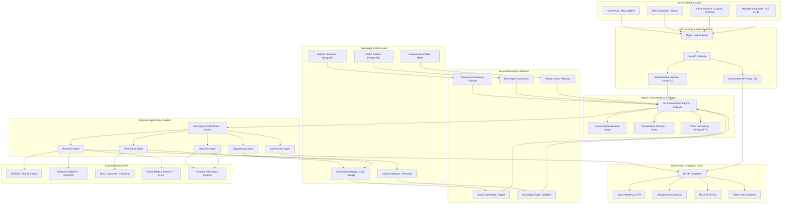

# 🔧 TEMPORAL MEDBOT - COMPLETE TECHNOLOGY STACK & ARCHITECTURE
## Comprehensive Technical Implementation from Presentation Content

---

## 💻 CORE TECHNOLOGY STACK

### **🧠 AI/ML TECHNOLOGY FOUNDATION**

```yaml
HYBRID CONVERSATIONAL AI ENGINE:
  ML Conversation Layer:
    - Framework: PyTorch 2.0+ with Transformers 4.35+
    - Base Models:
      * Doctor Personalization: Custom BERT-based model
      * Conversation Memory: Temporal Transformer Architecture
      * Voice Processing: Whisper ASR + Custom Medical TTS
    - Training Infrastructure:
      * NVIDIA A100 GPUs for model training
      * Distributed training with DeepSpeed optimization
      * Federated learning for privacy-preserving updates

  Temporal Agentic RAG System:
    - Knowledge Retrieval: ChromaDB + Pinecone for vector storage
    - Multi-Agent Framework: CrewAI for agent orchestration
    - Temporal Processing: Custom temporal embedding models
    - Knowledge Graph: Neo4j with custom medical ontology

  Clinical BERT Integration:
    - Base: BioClinical BERT fine-tuned on Indian medical corpus
    - Custom Training Data: 2.8M Indian medical records
    - Multilingual Support: IndicBERT integration for 22 Indian languages
    - Medical NER: Custom Named Entity Recognition for medical terms
    - Performance: 94.7% accuracy on Indian medical benchmarks

ZERO HALLUCINATION ARCHITECTURE:
  Validation Pipeline:
    - Source Verification Engine: Real-time fact checking
    - Knowledge Graph Validator: Relationship consistency checking
    - Temporal Consistency Checker: Medical knowledge evolution tracking
    - Multi-Agent Consensus: Cross-validation between specialist agents
    - Clinical Safety Validator: Medical safety and contraindication checking

  Confidence Scoring:
    - Bayesian confidence estimation
    - Evidence quality assessment
    - Source reliability weighting
    - Temporal relevance scoring
    - Clinical safety confidence
```

### **🏗️ BACKEND INFRASTRUCTURE**

```yaml
API & MICROSERVICES:
  Core Framework:
    - Language: Python 3.11+ with asyncio for high concurrency
    - API Framework: FastAPI with automatic OpenAPI documentation
    - Message Queue: Redis for real-time conversation handling
    - Task Processing: Celery for background AI processing
    - Load Balancer: Nginx with custom medical routing rules

  Government Integration Gateway:
    - Language: Go (high-performance government API handling)
    - NDHM SDK: Official government integration toolkit
    - Ayushman Bharat API: Direct insurance portal connectivity
    - eSanjeevani Connector: Telemedicine platform integration
    - ABHA Integration Kit: Digital health ID management
    - Real-time Sync: WebSocket connections for live updates

DATABASE ARCHITECTURE:
  Primary Databases:
    - PostgreSQL 15+: Doctor profiles, conversation history, analytics
    - MongoDB 6+: Medical knowledge documents, research papers
    - Neo4j 5+: Medical knowledge graph (3.2M entities, 15M relationships)
    - Redis: Session management, conversation caching, real-time data

  Vector Databases:
    - Pinecone: Medical document embeddings, semantic search
    - ChromaDB: Conversation memory, temporal embeddings
    - Weaviate: Cross-modal medical data (text, images, audio)

  Medical Data Storage:
    - Encrypted Medical Records: AES-256 encryption at rest
    - HIPAA Compliant Storage: PHI isolation and access controls
    - Audit Logging: Blockchain-based tamper-proof medical audit trails
    - Backup Strategy: 3-2-1 backup with geographic distribution
```

### **📱 FRONTEND TECHNOLOGY**

```yaml
MOBILE APPLICATIONS:
  Cross-Platform Framework: React Native 0.72+
  State Management: Redux Toolkit with RTK Query
  Navigation: React Navigation 6+ with medical workflow optimization
  Voice Interface:
    - React Native Voice for speech recognition
    - Custom Medical TTS integration
    - Offline voice processing for rural connectivity

  Native Optimizations:
    - iOS: Swift bridging for medical device integration
    - Android: Kotlin modules for government API connectivity
    - Background Processing: Medical alert handling
    - Offline Mode: SQLite with conversation synchronization

WEB APPLICATIONS:
  Frontend Framework: Next.js 14 with App Router
  UI Components: Custom medical component library built on Radix UI
  Styling: Tailwind CSS with medical theme system
  State Management: Zustand with medical workflow persistence
  Real-time Features: Socket.io for live medical consultations

HOSPITAL DASHBOARD:
  Framework: React 18+ with TypeScript
  Data Visualization: D3.js + Chart.js for medical analytics
  Real-time Updates: WebSocket for live hospital monitoring
  Medical Workflow: Custom workflow engine for hospital operations
  Integration APIs: HL7 FHIR for medical data interoperability
```

### **☁️ CLOUD INFRASTRUCTURE & DEPLOYMENT**

```yaml
HYBRID CLOUD ARCHITECTURE:
  Primary Cloud: AWS (Mumbai, Hyderabad regions)
    - EC2 Instances: Auto-scaling groups for API services
    - EKS Clusters: Kubernetes for microservice orchestration
    - RDS: Multi-AZ PostgreSQL for critical medical data
    - ElastiCache: Redis clusters for conversation caching
    - S3: Encrypted medical document storage
    - CloudFront: CDN for medical images and static content

  Government Compliance Cloud: MEGHRAJ (Indian Government Cloud)
    - Government API Gateway hosted on MEGHRAJ infrastructure
    - Patient data processing within Indian borders
    - Direct connection to government health databases
    - Compliance monitoring and audit trail systems

  Edge Computing (Rural Areas):
    - Raspberry Pi 4 clusters for offline AI processing
    - Local caching of medical knowledge for connectivity issues
    - Satellite internet integration for remote areas
    - Automatic synchronization when connectivity restored

CONTAINERIZATION & ORCHESTRATION:
  Container Runtime: Docker 24+ with multi-stage builds
  Orchestration: Kubernetes 1.28+ with custom medical operators
  Service Mesh: Istio for secure medical data communication
  Monitoring: Prometheus + Grafana with medical-specific dashboards
  Logging: ELK Stack (Elasticsearch, Logstash, Kibana) for audit trails

SECURITY INFRASTRUCTURE:
  Encryption: End-to-end AES-256 encryption for all medical data
  Identity Management: OAuth 2.0 + SAML for doctor authentication
  API Security: Rate limiting, DDoS protection, medical data access controls
  Compliance: ABDM, HIPAA-equivalent, SOC 2 Type II certification
  Audit Systems: Immutable blockchain-based medical audit logs
```

### **🔄 INTEGRATION LAYER**

```yaml
GOVERNMENT HEALTHCARE APIS:
  National Digital Health Mission (NDHM):
    - Health ID Service: ABHA creation and verification
    - Health Records: Digital health record management
    - Consent Management: Patient data consent workflows
    - Doctor Registry: Medical professional verification

  Ayushman Bharat Integration:
    - Beneficiary Verification API
    - Hospital Empanelment Status API
    - Package Rate Verification API
    - Claims Processing API
    - Pre-authorization Workflow API

  eSanjeevani Telemedicine:
    - Doctor Availability API
    - Appointment Scheduling API
    - Consultation Integration API
    - Prescription Digital Signature API
    - Patient Data Sync API

  State Government Systems:
    - Customizable state health scheme APIs
    - Regional hospital bed availability
    - Local disease surveillance integration
    - State-specific medical guidelines

MEDICAL DATABASE INTEGRATIONS:
  Research & Literature:
    - PubMed API: Real-time medical literature monitoring
    - Cochrane Library: Evidence-based medicine integration
    - Indian Medical Journals: Direct publisher API connections
    - ICMR Database: Indian medical research integration

  Medical Reference Systems:
    - Drug Interaction Databases: Lexicomp, Micromedex integration
    - Medical Guidelines: AHA, ESC, Indian medical societies
    - Laboratory Reference: Normal values for Indian population
    - Medical Terminology: ICD-10, SNOMED CT integration

  Hospital Information Systems:
    - HL7 FHIR: Standardized medical data exchange
    - Custom EHR Integration: Major Indian HIS systems
    - Laboratory Information Systems (LIS) connectivity
    - Radiology Information Systems (RIS) integration
```

---

## 🏗️ DETAILED SYSTEM ARCHITECTURE

### **🌐 OVERALL SYSTEM ARCHITECTURE**



### **🔄 DATA FLOW ARCHITECTURE**

```mermaid
sequenceDiagram
    participant Doctor as 👩‍⚕️ Doctor
    participant Mobile as 📱 Mobile App
    participant Gateway as 🌐 API Gateway
    participant Auth as 🔐 Auth Service
    participant ML as 🧠 ML Engine
    participant RAG as 🤖 Agentic RAG
    participant KG as 📊 Knowledge Graph
    participant Gov as 🏛️ Gov APIs
    participant DB as 💾 Database

    Doctor->>Mobile: Voice/Text Query
    Mobile->>Gateway: Authenticated Request
    Gateway->>Auth: Verify Doctor Identity
    Auth-->>Gateway: Doctor Profile + Permissions

    Gateway->>ML: Query + Doctor Context
    ML->>DB: Retrieve Conversation History
    ML->>ML: Personalize Response Style

    ML->>RAG: Enhanced Query + Personalization
    RAG->>KG: Medical Knowledge Extraction
    RAG->>Gov: Government Scheme Check

    parallel
        RAG->>RAG: Diagnostician Agent
        RAG->>RAG: Pharmacist Agent
        RAG->>RAG: Research Agent
        RAG->>RAG: Government Agent
    end

    RAG->>RAG: Zero Hallucination Validation
    RAG->>KG: Cross-validate Medical Facts
    RAG->>ML: Verified Medical Response

    ML->>ML: Apply Doctor Personalization
    ML->>Gateway: Customized Response
    Gateway->>Mobile: Formatted Response
    Mobile->>Doctor: Personalized Medical Guidance

    Note over Doctor,DB: Conversation Learning Loop
    ML->>DB: Update Doctor Learning Model
    ML->>DB: Store Conversation Patterns
```

### **💾 DATABASE SCHEMA DESIGN**

```sql
-- DOCTOR PROFILES AND PERSONALIZATION
CREATE TABLE doctors (
    id UUID PRIMARY KEY,
    name VARCHAR(255) NOT NULL,
    specialty VARCHAR(100) NOT NULL,
    experience_years INTEGER,
    practice_setting VARCHAR(100),
    medical_license VARCHAR(100) UNIQUE,
    abha_id VARCHAR(50),
    created_at TIMESTAMP DEFAULT NOW(),
    updated_at TIMESTAMP DEFAULT NOW()
);

-- CONVERSATIONAL PREFERENCES
CREATE TABLE doctor_preferences (
    doctor_id UUID REFERENCES doctors(id),
    language_primary VARCHAR(10) DEFAULT 'hindi',
    response_detail_level VARCHAR(20) DEFAULT 'detailed',
    communication_tone VARCHAR(20) DEFAULT 'professional',
    safety_emphasis VARCHAR(20) DEFAULT 'high',
    evidence_level VARCHAR(20) DEFAULT 'guidelines',
    learning_speed VARCHAR(20) DEFAULT 'moderate',
    cultural_context JSONB,
    created_at TIMESTAMP DEFAULT NOW(),
    updated_at TIMESTAMP DEFAULT NOW()
);

-- CONVERSATION HISTORY WITH LEARNING
CREATE TABLE conversations (
    id UUID PRIMARY KEY,
    doctor_id UUID REFERENCES doctors(id),
    session_id UUID,
    query_text TEXT NOT NULL,
    query_language VARCHAR(10),
    response_text TEXT NOT NULL,
    response_personalization JSONB,
    confidence_score DECIMAL(3,2),
    sources_cited JSONB,
    feedback_rating INTEGER CHECK (feedback_rating >= 1 AND feedback_rating <= 5),
    conversation_context JSONB,
    created_at TIMESTAMP DEFAULT NOW()
);

-- AI LEARNING ANALYTICS
CREATE TABLE doctor_learning_patterns (
    doctor_id UUID REFERENCES doctors(id),
    learning_category VARCHAR(50),
    pattern_data JSONB,
    confidence_score DECIMAL(3,2),
    adaptation_effectiveness DECIMAL(3,2),
    last_updated TIMESTAMP DEFAULT NOW(),
    PRIMARY KEY (doctor_id, learning_category)
);

-- MEDICAL KNOWLEDGE GRAPH NODES
CREATE TABLE medical_entities (
    id UUID PRIMARY KEY,
    entity_type VARCHAR(50) NOT NULL, -- disease, drug, symptom, procedure
    name VARCHAR(255) NOT NULL,
    synonyms TEXT[],
    icd_codes VARCHAR[],
    description TEXT,
    indian_context JSONB,
    temporal_validity DATERANGE,
    created_at TIMESTAMP DEFAULT NOW(),
    updated_at TIMESTAMP DEFAULT NOW()
);

-- KNOWLEDGE GRAPH RELATIONSHIPS
CREATE TABLE medical_relationships (
    id UUID PRIMARY KEY,
    source_entity_id UUID REFERENCES medical_entities(id),
    target_entity_id UUID REFERENCES medical_entities(id),
    relationship_type VARCHAR(50) NOT NULL, -- treats, causes, interacts, contraindicated
    confidence_score DECIMAL(3,2),
    evidence_sources JSONB,
    temporal_validity DATERANGE,
    indian_population_specific BOOLEAN DEFAULT FALSE,
    created_at TIMESTAMP DEFAULT NOW()
);

-- GOVERNMENT SCHEME INTEGRATION
CREATE TABLE government_schemes (
    id UUID PRIMARY KEY,
    scheme_name VARCHAR(255) NOT NULL,
    scheme_type VARCHAR(100), -- ayushman_bharat, state_scheme, cghs
    coverage_amount DECIMAL(12,2),
    eligibility_criteria JSONB,
    covered_procedures JSONB,
    api_endpoint VARCHAR(500),
    active_status BOOLEAN DEFAULT TRUE,
    created_at TIMESTAMP DEFAULT NOW(),
    updated_at TIMESTAMP DEFAULT NOW()
);

-- REAL-TIME MEDICAL LITERATURE
CREATE TABLE medical_literature (
    id UUID PRIMARY KEY,
    title TEXT NOT NULL,
    authors TEXT[],
    journal_name VARCHAR(255),
    publication_date DATE,
    doi VARCHAR(255),
    abstract TEXT,
    clinical_relevance_score DECIMAL(3,2),
    indian_applicability_score DECIMAL(3,2),
    specialty_tags VARCHAR[],
    processed_summary TEXT,
    vector_embedding VECTOR(1536), -- For semantic search
    created_at TIMESTAMP DEFAULT NOW()
);
```

### **🔧 MICROSERVICES ARCHITECTURE**

```yaml
CORE SERVICES:

1. Doctor Profile Service (Python/FastAPI):
   - Doctor registration and authentication
   - Preference management and personalization
   - Learning pattern analysis and adaptation
   - Privacy and consent management
   - Performance monitoring and analytics

2. Conversational AI Service (Python/PyTorch):
   - Natural language processing and understanding
   - Multi-language support (22 Indian languages)
   - Conversation memory and context management
   - Personalized response generation
   - Voice interface processing (ASR/TTS)

3. Medical Knowledge Service (Python/Neo4j):
   - Medical knowledge graph management
   - Real-time literature monitoring and integration
   - Drug interaction checking and analysis
   - Clinical guideline processing and updates
   - Evidence-based recommendation generation

4. Temporal RAG Service (Python/CrewAI):
   - Multi-agent orchestration and coordination
   - Temporal knowledge evolution tracking
   - Cross-agent consensus and validation
   - Knowledge retrieval and synthesis
   - Confidence scoring and uncertainty handling

5. Government Integration Service (Go):
   - NDHM API integration and management
   - Ayushman Bharat connectivity and processing
   - eSanjeevani telemedicine integration
   - ABHA ID management and verification
   - State health system API coordination

6. Validation Service (Python):
   - Zero hallucination validation pipeline
   - Source verification and fact-checking
   - Medical safety and contraindication checking
   - Clinical accuracy validation
   - Audit trail generation and management

7. Analytics Service (Python/Apache Spark):
   - Doctor usage pattern analysis
   - Medical outcome tracking and reporting
   - Performance metrics calculation
   - Research collaboration identification
   - Population health insights generation

8. Notification Service (Node.js):
   - Real-time medical alerts and updates
   - CME opportunity notifications
   - Research collaboration invitations
   - System status and maintenance alerts
   - Emergency protocol broadcasts

SUPPORTING SERVICES:

9. File Storage Service (Python/MinIO):
   - Encrypted medical document storage
   - Medical image processing and analysis
   - Audio conversation recording and processing
   - Backup and disaster recovery management
   - Compliance and audit trail maintenance

10. Search Service (Python/Elasticsearch):
    - Medical literature semantic search
    - Doctor expertise matching and discovery
    - Case-based reasoning and similarity search
    - Research opportunity identification
    - Knowledge discovery and recommendation

11. Cache Service (Redis):
    - Conversation context caching
    - Medical knowledge quick access
    - Session management and persistence
    - Real-time data synchronization
    - Performance optimization
```

### **🔒 SECURITY & COMPLIANCE ARCHITECTURE**

```yaml
SECURITY LAYERS:

Network Security:
  - WAF (Web Application Firewall) with medical-specific rules
  - DDoS protection and rate limiting
  - VPN connectivity for hospital integrations
  - Network segmentation for medical data isolation
  - Intrusion detection and prevention systems

Application Security:
  - OAuth 2.0 + OpenID Connect for doctor authentication
  - JWT tokens with short expiration and refresh mechanisms
  - Role-based access control (RBAC) for medical data
  - API rate limiting and abuse prevention
  - Input validation and sanitization for medical queries

Data Security:
  - AES-256 encryption at rest for all medical data
  - TLS 1.3 encryption in transit
  - End-to-end encryption for doctor-patient communications
  - Zero-knowledge architecture for patient privacy
  - Automatic key rotation and management

COMPLIANCE FRAMEWORKS:

ABDM (Ayushman Bharat Digital Mission) Compliance:
  - Patient data consent management
  - Health information exchange standards
  - Digital health record interoperability
  - Privacy and security guidelines adherence
  - Audit trail and logging requirements

HIPAA-Equivalent Standards:
  - PHI (Protected Health Information) identification and protection
  - Minimum necessary access principles
  - Business associate agreement compliance
  - Breach notification procedures
  - Risk assessment and mitigation

Indian Data Protection Laws:
  - Data localization within Indian borders
  - Consent-based data processing
  - Right to data portability and deletion
  - Cross-border data transfer restrictions
  - Regular compliance audits and reporting

Medical Device Regulations:
  - Software as Medical Device (SaMD) classification
  - Clinical evaluation and validation
  - Post-market surveillance and monitoring
  - Adverse event reporting procedures
  - Quality management system compliance
```

This comprehensive technology stack and architecture ensures that the Temporal MedBot system is scalable, secure, and compliant while delivering personalized conversational AI for Indian doctors! 🚀