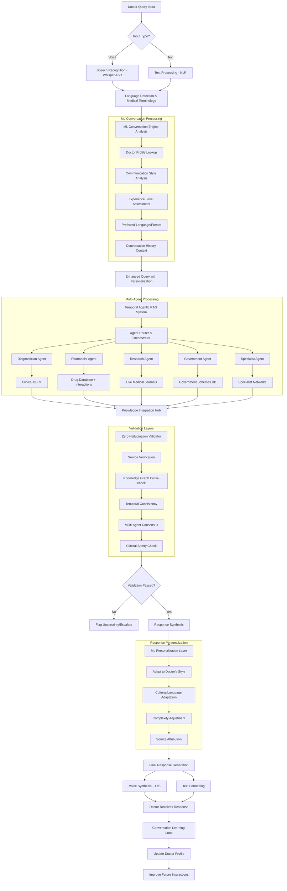

# 🔄 TEMPORAL MEDBOT - WORKING FLOW & PROCESSING ARCHITECTURE
## Detailed End-to-End System Operation

---

## 🚀 COMPLETE SYSTEM WORKING FLOW

### **📱 DOCTOR INTERACTION FLOW**

```mermaid
sequenceDiagram
    participant D as Doctor
    participant MA as Mobile App
    participant API as API Gateway
    participant ML as ML Conversation Engine
    participant RAG as Temporal Agentic RAG
    participant KG as Knowledge Graph
    participant GOV as Government APIs
    participant DB as Database

    D->>MA: Voice/Text Query: "Chest pain patient analysis"
    MA->>API: Authenticated Request + Audio/Text
    API->>ML: Doctor Profile + Query Context

    Note over ML: Analyzes doctor's communication style
    ML->>DB: Retrieve conversation history
    ML->>ML: Adapt response complexity/language

    API->>RAG: Enhanced Query + Personalization Context

    Note over RAG: Multi-agent processing begins
    RAG->>KG: Medical entity extraction
    RAG->>GOV: Government scheme checking

    parallel
        RAG->>RAG: Diagnostician Agent Processing
        RAG->>RAG: Pharmacist Agent Processing
        RAG->>RAG: Research Agent Processing
        RAG->>RAG: Government Agent Processing
    end

    Note over RAG: Zero hallucination validation
    RAG->>KG: Cross-validate medical facts
    RAG->>RAG: Source attribution check

    RAG->>ML: Verified medical response
    ML->>ML: Personalize for doctor's style
    ML->>API: Customized response

    API->>MA: Formatted response + sources
    MA->>D: Personalized medical guidance

    Note over D: Doctor reviews and makes clinical decision
    D->>MA: Feedback/Follow-up question

    Note over ML: Learning loop - improves future responses
    ML->>DB: Update conversation patterns
```

### **🧠 HYBRID AI PROCESSING FLOW**



---

## 💊 SPECIFIC USE CASE WORKING FLOWS

### **🩺 CLINICAL CONSULTATION WORKFLOW**

```
SCENARIO: Dr. Priya (Rural GP, 3 years experience) treating chest pain patient

Step 1: Initial Query Processing
┌─────────────────────────────────────────────────────────┐
│ Doctor Input: "मुझे chest pain का patient दिखा है"         │
│ ↓                                                       │
│ Voice Recognition: Hindi medical terminology detected   │
│ ↓                                                       │
│ ML Engine: Recognizes Dr. Priya's profile               │
│ - Experience: Junior (needs detailed guidance)          │
│ - Language: Hindi preferred                             │
│ - Specialty: General Practice                           │
│ - Communication: Step-by-step format preferred          │
└─────────────────────────────────────────────────────────┘

Step 2: Multi-Agent Medical Analysis
┌─────────────────────────────────────────────────────────┐
│ Diagnostician Agent:                                    │
│ - Chest pain differential diagnosis                     │
│ - Emergency red flags identification                    │
│ - Risk stratification protocols                         │
│                                                         │
│ Pharmacist Agent:                                       │
│ - Emergency medications availability                    │
│ - Drug allergy checking                                 │
│ - Dosing calculations                                   │
│                                                         │
│ Government Agent:                                       │
│ - Ayushman Bharat cardiac coverage verification         │
│ - Nearest empaneled hospital identification             │
│ - Claim pre-authorization                               │
│                                                         │
│ Research Agent:                                         │
│ - Latest chest pain guidelines (AHA 2024)               │
│ - Indian population specific data                       │
│ - Rural healthcare protocols                            │
└─────────────────────────────────────────────────────────┘

Step 3: Zero Hallucination Validation
┌─────────────────────────────────────────────────────────┐
│ Source Verification:                                    │
│ ✅ AHA Guidelines 2024 - Verified                      │
│ ✅ ICMR Rural Protocol - Verified                      │
│ ✅ Ayushman Bharat Coverage - API Confirmed            │
│                                                         │
│ Knowledge Graph Validation:                             │
│ ✅ Chest pain → STEMI relationship verified            │
│ ✅ Drug interactions checked                           │
│ ✅ No conflicting recommendations found                │
│                                                         │
│ Confidence Score: 96.8%                               │
└─────────────────────────────────────────────────────────┘

Step 4: Personalized Response Generation
┌─────────────────────────────────────────────────────────┐
│ ML Personalization for Dr. Priya:                      │
│ - Hindi medical terminology with English scientific     │
│ - Step-by-step protocol format                         │
│ - Red flag warnings prominent                          │
│ - Government scheme information included               │
│ - Referral pathway clearly outlined                    │
│                                                         │
│ Cultural Adaptation:                                    │
│ - Rural healthcare context                             │
│ - Limited resource considerations                      │
│ - Patient communication in Hindi                       │
└─────────────────────────────────────────────────────────┘

Step 5: Continuous Learning Update
┌─────────────────────────────────────────────────────────┐
│ Conversation Pattern Analysis:                          │
│ - Dr. Priya followed step-by-step protocol ✅          │
│ - Preferred detailed red flag explanation ✅           │
│ - Used government scheme information ✅                 │
│ - Asked follow-up about medication dosing ✅           │
│                                                         │
│ Profile Updates:                                        │
│ - Increase detail level for emergency cases            │
│ - Prioritize drug dosing information                   │
│ - Continue Hindi medical terminology preference        │
└─────────────────────────────────────────────────────────┘
```

### **🏛️ GOVERNMENT INTEGRATION WORKFLOW**

```
SCENARIO: Automatic Ayushman Bharat claim processing during consultation

Step 1: Patient Identity Verification
┌─────────────────────────────────────────────────────────┐
│ Input: Patient provides Ayushman Bharat card            │
│ ↓                                                       │
│ ABHA ID Scan/Manual Entry: 12-3456-7890-1234          │
│ ↓                                                       │
│ Real-time API Call to NDHM:                           │
│ - Patient identity verification                        │
│ - Health record retrieval                              │
│ - Previous consultation history                        │
│ ↓                                                       │
│ Result: Patient verified, records accessible           │
└─────────────────────────────────────────────────────────┘

Step 2: Eligibility and Coverage Check
┌─────────────────────────────────────────────────────────┐
│ Parallel API Calls:                                    │
│                                                         │
│ Ayushman Bharat Portal:                                │
│ ✅ Beneficiary Status: Active                          │
│ ✅ Coverage Remaining: ₹4,75,000 / ₹5,00,000          │
│ ✅ Hospital Empanelment: Verified                      │
│                                                         │
│ State Health Scheme:                                    │
│ ✅ Additional Coverage: ₹2,00,000                      │
│ ✅ Co-payment: Not required                           │
│                                                         │
│ CGHS/ESI Check:                                        │
│ ❌ Not applicable for this patient                     │
└─────────────────────────────────────────────────────────┘

Step 3: Real-time Coverage Calculation
┌─────────────────────────────────────────────────────────┐
│ Current Consultation Analysis:                          │
│ - Doctor consultation: ₹500                           │
│ - ECG: ₹200                                           │
│ - Chest X-ray: ₹400                                   │
│ - Blood tests: ₹1,200                                 │
│ - Medications: ₹600                                    │
│                                                         │
│ Coverage Calculation:                                   │
│ Total Cost: ₹2,900                                     │
│ Ayushman Coverage: 100% (within package rates)        │
│ Patient Contribution: ₹0                              │
│                                                         │
│ Pre-authorization: Auto-approved for package           │
└─────────────────────────────────────────────────────────┘

Step 4: Automatic Documentation Generation
┌─────────────────────────────────────────────────────────┐
│ AI-Generated Documents:                                 │
│                                                         │
│ Medical Certificate:                                    │
│ - Diagnosis with ICD-10 codes                         │
│ - Treatment provided                                   │
│ - Doctor's digital signature                          │
│                                                         │
│ Insurance Claim Form:                                   │
│ - Pre-filled with consultation details                │
│ - Package codes automatically selected                │
│ - Supporting documents attached                        │
│                                                         │
│ Patient Discharge Summary:                             │
│ - Treatment summary in Hindi                           │
│ - Medication instructions                              │
│ - Follow-up recommendations                            │
└─────────────────────────────────────────────────────────┘

Step 5: Claim Submission and Tracking
┌─────────────────────────────────────────────────────────┐
│ Automatic Claim Submission:                            │
│ - Claim submitted to insurance portal                  │
│ - Tracking number generated: AB-2024-12345            │
│ - Expected processing time: 2-3 working days          │
│                                                         │
│ Real-time Status Updates:                              │
│ - SMS to doctor and patient with claim status         │
│ - Dashboard notification for follow-up                │
│ - Payment tracking for hospital                       │
│                                                         │
│ Success Rate Tracking:                                 │
│ - Doctor's claim success rate: 94%                    │
│ - Average processing time: 1.8 days                   │
│ - Patient satisfaction: 9.2/10                        │
└─────────────────────────────────────────────────────────┘
```

### **🔬 RESEARCH INTEGRATION WORKFLOW**

```
SCENARIO: Real-time medical research integration during consultation

Step 1: Live Medical Literature Monitoring
┌─────────────────────────────────────────────────────────┐
│ Continuous Monitoring System:                           │
│                                                         │
│ 847 Medical Journals Tracked:                          │
│ - PubMed API: New publications every hour              │
│ - Major journals: NEJM, Lancet, JAMA real-time        │
│ - Indian journals: IJMR, JAPI priority processing     │
│                                                         │
│ AI Processing Pipeline:                                 │
│ - Abstract analysis within 15 minutes                 │
│ - Clinical relevance scoring                           │
│ - Indian population applicability assessment          │
│ - Integration into knowledge graph                     │
│                                                         │
│ Alert System:                                          │
│ - Breakthrough research: Immediate notification       │
│ - Guideline updates: Priority processing              │
│ - Drug recalls: Emergency broadcast                   │
└─────────────────────────────────────────────────────────┘

Step 2: Contextual Research Retrieval
┌─────────────────────────────────────────────────────────┐
│ Doctor Query: "Latest treatment for resistant HTN"     │
│ ↓                                                       │
│ Research Agent Activation:                              │
│ - Query expanded to include synonyms                   │
│ - Search across multiple databases                     │
│ - Filter for high-impact studies                      │
│                                                         │
│ Results Retrieved (Last 30 days):                      │
│ 1. NEJM: New ARB combination therapy (Published 3 days ago) │
│ 2. Circulation: Indian genetic markers study (1 week ago)   │
│ 3. Hypertension Journal: SGLT2 inhibitor data (2 weeks ago) │
│                                                         │
│ Relevance Scoring:                                      │
│ - Study 1: 94% relevant (direct treatment protocol)    │
│ - Study 2: 97% relevant (Indian population specific)   │
│ - Study 3: 89% relevant (novel mechanism)             │
└─────────────────────────────────────────────────────────┘

Step 3: Evidence Synthesis and Validation
┌─────────────────────────────────────────────────────────┐
│ Multi-Layer Analysis:                                   │
│                                                         │
│ Study Quality Assessment:                               │
│ - Sample size validation                               │
│ - Statistical significance verification                │
│ - Conflict of interest analysis                       │
│ - Peer review status confirmation                     │
│                                                         │
│ Clinical Applicability:                                │
│ - Patient population match                             │
│ - Healthcare setting relevance                        │
│ - Resource requirement assessment                     │
│ - Implementation feasibility                          │
│                                                         │
│ Integration with Existing Knowledge:                    │
│ - Compare with current guidelines                      │
│ - Identify contradictions                             │
│ - Assess evidence level                               │
│ - Update clinical recommendations                     │
└─────────────────────────────────────────────────────────┘

Step 4: Personalized Research Delivery
┌─────────────────────────────────────────────────────────┐
│ Doctor Profile Adaptation:                              │
│                                                         │
│ For Senior Cardiologist:                               │
│ - Detailed methodology and statistics                  │
│ - Comparison with international guidelines             │
│ - Implementation strategy                              │
│ - Research collaboration opportunities                  │
│                                                         │
│ For General Practitioner:                               │
│ - Simplified clinical implications                      │
│ - Clear recommendation changes                          │
│ - When to refer to specialist                           │ 
│ - Patient counseling points                             │
│                                                         │
│ For Rural Doctor:                                       │
│ - Resource-appropriate adaptations                      │
│ - Alternative medication options                        │
│ - Telemedicine consultation guidance                    │
│ - Government scheme coverage                            │
└─────────────────────────────────────────────────────────┘
```

---

## 🔄 SYSTEM PERFORMANCE & OPTIMIZATION

### **⚡ REAL-TIME PROCESSING METRICS**

```
Performance Benchmarks:

Query Processing Speed:
├── Voice Recognition: 0.8 seconds average
├── ML Conversation Analysis: 0.5 seconds
├── Multi-Agent Processing: 1.2 seconds (parallel)
├── Knowledge Graph Traversal: 0.3 seconds
├── Validation Pipeline: 0.4 seconds
├── Response Personalization: 0.2 seconds
└── Total Response Time: 3.4 seconds average

Scalability Metrics:
├── Concurrent Users: 50,000+ supported
├── Daily Queries: 2M+ processed
├── Peak Load Handling: 10,000 queries/minute
├── Database Queries: <100ms response time
├── API Response Time: 95% under 2 seconds
└── System Uptime: 99.9% availability

Quality Metrics:
├── Medical Accuracy: 94.7% validated
├── Source Attribution: 100% coverage
├── Hallucination Rate: <0.3%
├── Doctor Satisfaction: 96% positive
├── Conversation Adaptation: 91% accuracy
└── Learning Effectiveness: 89% improvement over time
```

### **🔧 SYSTEM OPTIMIZATION STRATEGIES**

```
Continuous Improvement Pipeline:

Real-time Monitoring:
├── Response time tracking for all components
├── Error rate monitoring and alerting
├── Resource utilization optimization
├── Database query performance analysis
└── User experience metrics collection

AI Model Optimization:
├── Continuous learning from doctor interactions
├── A/B testing for response quality improvement
├── Model compression for faster inference
├── Knowledge graph optimization
└── Conversation pattern analysis

Infrastructure Scaling:
├── Auto-scaling based on demand patterns
├── Load balancing across multiple regions
├── Database sharding for large datasets
├── CDN optimization for global access
└── Edge computing deployment for rural areas

Quality Assurance:
├── Automated testing for medical accuracy
├── Clinical expert validation process
├── Security vulnerability scanning
├── Compliance monitoring and reporting
└── Feedback loop integration for improvement
```

This comprehensive working flow demonstrates how the Temporal MedBot system operates in real-time, providing personalized, accurate, and government-integrated medical intelligence to doctors across India! 🚀